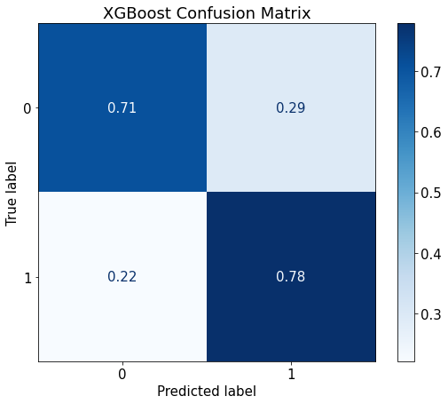
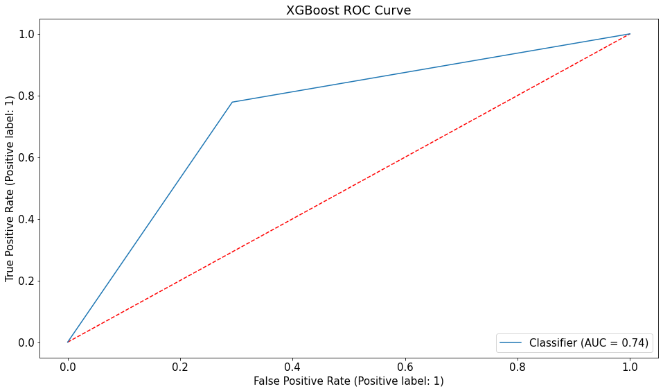

## Problem Statement

If we are able to categorize a customer based on the type of language they use when they ask Google Home stock market related questions, we will be able to better tailor marketing strategies, recommended products, and other platform-specific customizations that we can tailor for each customer type. Google's Sales, Service, and Support team has taken on a new, high-revenue generating client in the debt relief space and would like to market to prospective customers that are in need of debt relief, but Google's Sales, Service, and Support team is getting less Google searches for "debt relief" than they had initially anticipated. I recommend targeting users of r/wallstreetbets with the use of Natural Language Processing (NLP) through the Google Home, search, and other integrations. Google Home is currently unable to understand the linguistic nuances of wallstreetbets and thus, further data science exploration into this classification is needed.

With certain nuances in language, how can we differentiate between a consumer that regularly participates in r/wallstreetbets, from a typical individual investor? What words or phrases have the highest impact on classifying between wallstreetbetters and individual investors?

## Background

r/WallStreetBets is a subreddit of users who trade stocks on the public stock market as though it was a casino. Active users will infamously use savings upwards of $10,000 or more to bet on one stock. In most cases, they will also use options contracts or margin to increase leverage and maximize their risk and potential reward. This, in most cases, results in users going into debt. WallStreetBets skyrocketed in popularity after the Gamestop (GME) short squeeze in January 2021, as most of the discourse around the short squeeze existed on that subreddit. In some ways, it was the collective power of r/WallStreetBets that took the stock from approximately $4 to $344 (8500% growth) a share over the span of a few days. [source](https://en.wikipedia.org/wiki/R/wallstreetbets), [link](https://www.reddit.com/r/wallstreetbets)

r/Stocks is a subreddit of users that communicates to each other about advice regarding places that they should invest their money, as well as more specific investing advice such as allocation strategies. Generally speaking, r/Stocks users will default to a longer investment timeline and more diversified portfolios than r/WallStreetBets users. [link](https://www.reddit.com/r/stocks/)

## Dataset Used

- subreddit_data.csv: Contains text from posts in each document along with a classifying constant to differentiate between the subreddits

## Data Dictionary

|Feature|Type|Dataset|Description|
|---|---|---|---|
|**text**|*obj*|Subreddit Data|Subreddit Text|
|**is_wsb**|*int*|Subreddit Data|Subreddit Classification Number, 1 for r/wallstreetbets, 0 for r/stocks|

## Methods

- Subreddit Web Scraping / Data Collection
- Data Cleaning
- Exploratory Data Analysis (EDA)
- Oversampling (SMOTE)
- Model Deployment

## Results Summary

Confusion Matrix of XGBoost.

ROC Curve of XGBoost.

Top 3 models (with default parameters)

| Model     	                | Test Recall 	    |
|-------------------	        |------------------	|
| Logistic Regression         	| 75% 	            |
| KNearestClassifier       	    | 81% 	            |
| XGBoost                       | 78% 	            |

- ***The final model used is: XGBoost***
- ***Metrics used: Recall***

Why choose recall as the primary metric:

Choosing the primary metric for a classification problem is dependent on the data science or business problem. I am choosing recall as the primary metric here because we are trying to classify and differentiate between wallstreetbetters and individual investors. To have wallstreetbetters falsely labeled as individual investors would be fine and acceptable when considering the types of customized advertising experience they would receive, but to have individual investors falsely labeled as wallstreetbetters would confuse many investors, Google Home users, and internet users alike. This is due to the unique nature of r/wallstreetbets being a subculture within the investing/trading/gambling communities. Thus, we want to prioritize minimizing false negatives and maximize recall score.

## Insights and Recommendations / Next Steps

- Insights

Clean / non-profanity words that were identified by the model as the most important words in determining the classification between r/wallstreetbets and r/stocks, and are evidently related to the r/wallstreetbets community, include:

- dd
- moon
- meme
- yolo
- tendies
- wsb

- Recommendations / Next steps:
    - Implement model-weighted r/wallstreetbets specific keywords into the marketing tactics for client
    - Utilize wallstreetbets-specific keyword targeting (identified in Insights section) within Google Home, Google search, and other strategic integrations
    - This model does not take into consideration contextual language so please keep that in mind when taking any action with the insights derived from the model. For example, "moon" is a strong word when classifying between wallstreetbetters and individual investors but only in the context of finance. If a Google home user or Google search user uses the word "moon" in a different context, they should not be labeled as a wallstreetbetter.

## Limitations and Improvement Suggestions

- Further opportunity for hyperparameter tuning and model optimization
- Better optimizing data inputted into the model with specific data cleaning / RegEx
